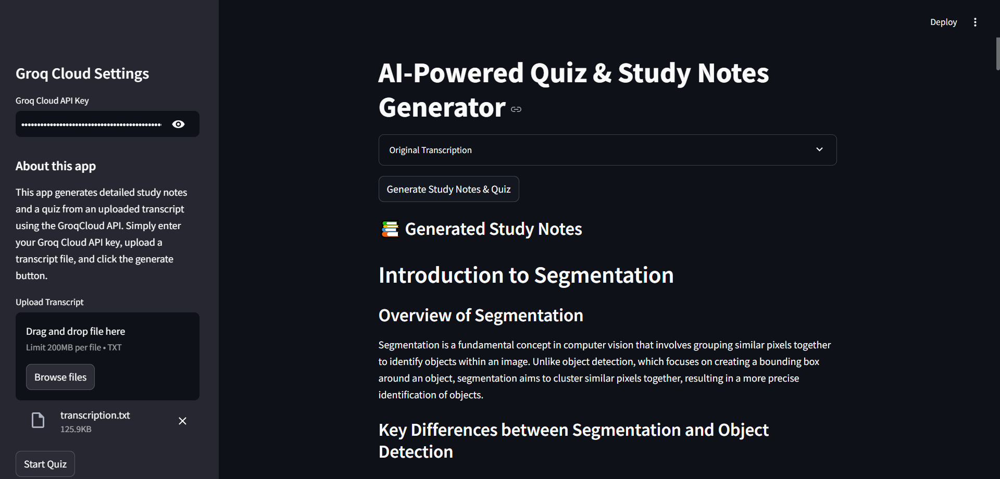
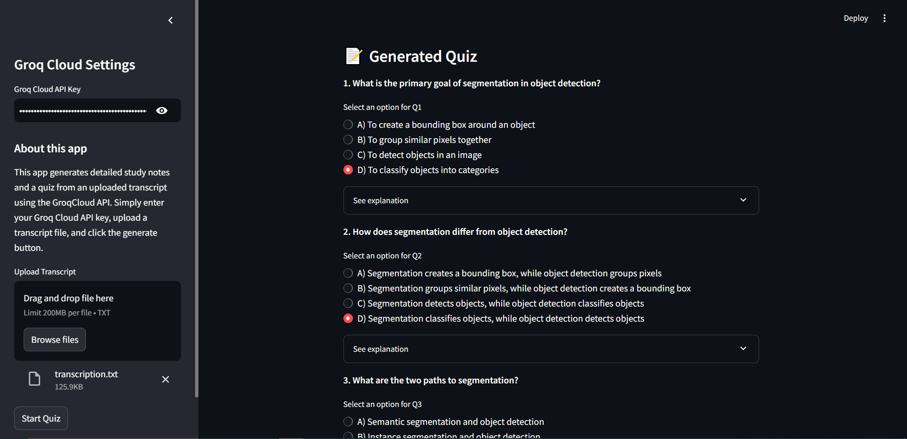

# AI-Powered Quiz & Study Notes Generator

## 📌 About This Project
This is a **Streamlit-based web application** that generates **study notes** and **quizzes** from lecture transcripts using the **Groq Cloud API**. Users can upload a transcript file, generate structured study notes, and take an automatically generated quiz. The results can be downloaded in **PDF format**.

## 🚀 Features
- 📄 **Upload Lecture Transcript** (TXT format)
- ✍️ **Generate Topic-Based Study Notes**
- ❓ **Create Multiple-Choice Quizzes** (10 questions per session)
- 📥 **Download Study Notes & Quiz in PDF Format**
- ✅ **Real-time Quiz Evaluation & Scoring**
- 🔐 **Secure API Key Input via Sidebar**

## 🛠️ Installation

### 1️⃣ Clone the Repository
```bash
git clone https://github.com/yourusername/your-repo-name.git
cd your-repo-name
```

### 2️⃣ Create a Virtual Environment (Recommended)
```bash
python -m venv venv
source venv/bin/activate  # On macOS/Linux
venv\Scripts\activate    # On Windows
```

### 3️⃣ Install Dependencies
```bash
pip install -r requirements.txt
```

### 4️⃣ Run the Application
```bash
streamlit run app.py
```

## 🔑 Setting Up Groq Cloud API
- **Enter your Groq API key** in the sidebar under `Groq Cloud API Key`.
- You can obtain the API key from [Groq Cloud](https://groq.com).

## 🎯 Usage Guide
1. **Upload a transcript file** (TXT format) from the sidebar.
2. Click on **"Generate Study Notes & Quiz"**.
3. View the **generated study notes**.
4. Click **"Start Quiz"** to attempt the questions.
5. Submit the quiz to see your **score**.
6. Download **study notes & quiz in PDF format**.

## 📸 Screenshots



## 📚 Technologies Used
- **Python** 🐍
- **Streamlit** (Web UI)
- **Groq Cloud API** (LLM-based Processing)
- **FPDF** (PDF Generation)
- **Regex & JSON** (Data Parsing)

## 📬 Contact
For any questions, reach out via vinaydhurwe@gmail.com(mailto:your-email@example.com) or open an **issue** on GitHub.

---
Made with ❤️ by [Your Name](https://github.com/yourusername)

